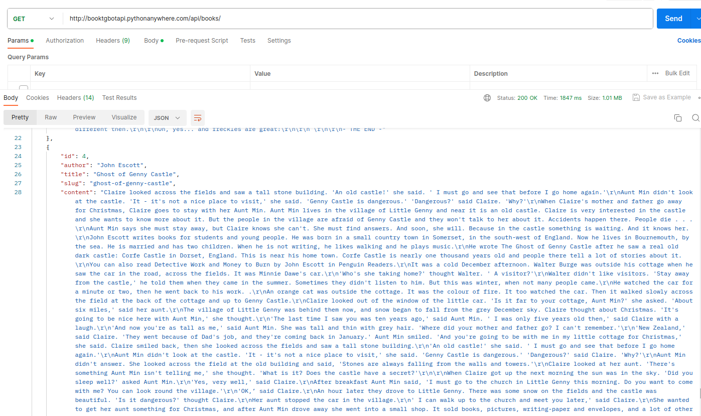

# <div align="center">BOOKS API DATA🔎</div>

<div align="center">

</div>

## Description

This project was created with the aim of providing API data for my [telegram bot](https://github.com/brestok-1/book-tg-bot), updating data, adding new books. It is
very simple in its structure, but its creation has improved my API integration and data parsing skills. [The project was deployed on pythonanywhere](http://booktgbotapi.pythonanywhere.com/api/books/)

## Technologies

***Language***


***Framework***


***Database***


***Libraries***


***Other***


I wrote a python bot using aiogram. I used two databases: Postgresql for storing user data, books and bookmarks, and
Redis for caching data and optimizing work. The bot takes data about books via API from
a [third-party service](https://github.com/brestok-1/drf-tg-data) and stores
them in the database. With the help of the Aiocron library, the database is updated every hour. I also connected an
alembic to initialize the database and create migrations

## Project setup

***Method 1: Via docker-compose***

1. Create a .env file and paste the data from the .env.example file into it
2. In REDIS_HOST and POSTGRES_HOST, specify the names of docker-compose services (redis and db)
3. In BOT_TOKEN, specify the token of your telegram bot created earlier via BotFather
4. In the terminal, enter the following command:

```
docker-compose up --build
```

***Method 2: Via virtual environment***

1. Create and activate a python virtual environment
2. In the terminal, enter the following command:

```
pip3 install -r requirements.txt
```

3. Create a .env file and paste the data from the .env.example file into it
4. In REDIS_HOST and POSTGRES_HOST, specify localhost
5. In BOT_TOKEN, specify the token of your telegram bot created earlier via BotFather
6. Run the file bot.py

## <div align="center">Thank you for taking the time to review my project. Enjoy reading!👋</div>